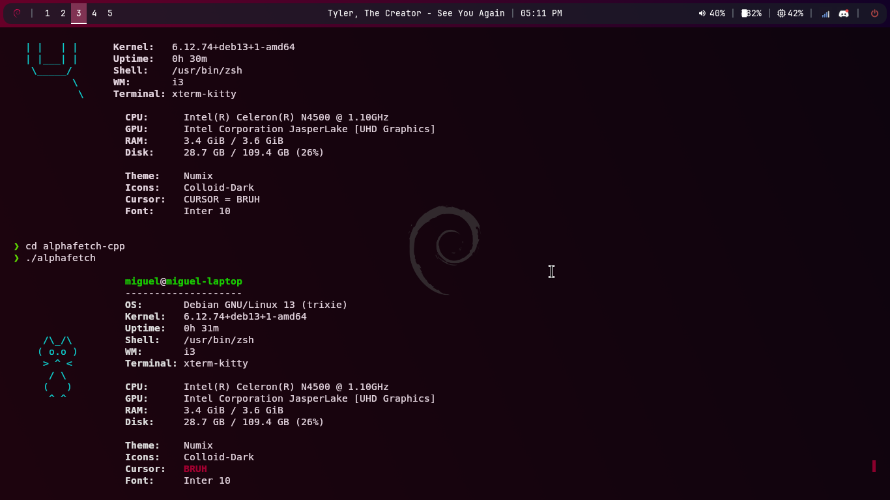
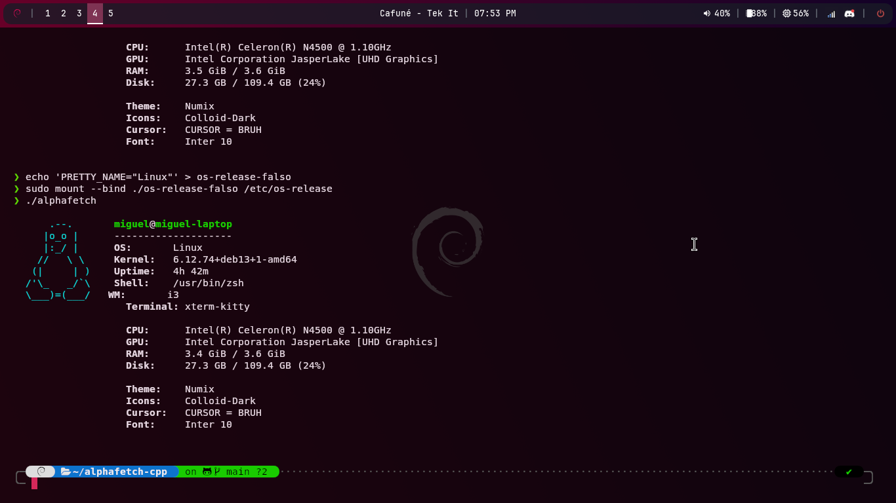

# alphafetch

Um buscador de informações do sistema (fetch) rápido, leve e modular, feito em C++20 para sistemas Linux.

> ⚠️ **Aviso:** Este projeto está nas suas primeiras versões! Quer customizar seu alphafetch? Altere o arquivo de configuração! Quer adicionar um módulo novo ou suporte ao KDE? **Aí é no código-fonte e contribuição!**
> *(Atualmente não há suporte ao KDE na parte de ricing, como detecção de cursor, tema e ícone).*

##  Demonstração



## Funcionalidades

* **Rápido e Leve:** Feito em C++ puro, sem interpretadores pesados.
* **Arquivo de Configuração:** Oculte ou exiba módulos sem precisar compilar o código de novo!
* **Modular:** Cada informação (CPU, GPU, RAM) tem seu próprio arquivo `.cpp`.
* **Completo:** Mostra informações de Hardware, Sistema, Temas GTK e uso de Disco/RAM.
* **Design Limpo:** Alinhamento automático lado a lado com arte ASCII calculada dinamicamente.

## Logos Customizadas e Argumentos

O `alphafetch` detecta a logo da sua distribuição automaticamente, mas você também pode forçar a exibição de qualquer logo salva na pasta `logos/` passando um argumento no terminal com o prefixo `-`.

Exemplos:
```bash
./alphafetch -php        # Exibe o elefantinho do PHP
./alphafetch -linuxmint  # Exibe a logo do Linux Mint
./alphafetch -arch       # Exibe a logo do Arch Linux
```
quer adicionar seu proprio ASCII? só jogar na pasta `logos/` e chamar ela!

## Configuração

O `alphafetch` agora suporta personalização através de um arquivo de configuração! Você pode ativar ou desativar os módulos que deseja ver na tela.

Para começar a usar, crie a pasta de configuração e copie o arquivo de exemplo:
```bash
mkdir -p ~/.config/alphafetch
cp examples/default.conf ~/.config/alphafetch/config.conf
```

Depois disso, basta abrir o ``~/.config/alphafetch/config.conf`` no seu editor favorito e mudar as opções de true para false como preferir!

## requisitos para funções especiais

- **para musica:** ``playerctl``(responsavel por detectar o que esta tocando no spotify, navegador etc).
``sudo apt install playerctl``

- **para a barra de progresso e icones:** O programa usa fontes Unicode e **símbolos das Nerd Fonts**. Para a melhor visualização possível, use uma Nerd Font no seu terminal (como a JetBrainsMono Nerd Font).

**nota sobre a distro:** O AlphaFetch foi desenvolvido e testado nativamente no **Debian 13 (Trixie)**, mas a galera de servidores do Discord já está botando ele para rodar em outras distros, como o Gentoo!

## 🛠️ Como Compilar e Instalar

**prés-requisitos**
Você precisará de um compilador que suporte C++20 (como o ``g++`` 10+) e do ``make``. No Debian/Ubuntu, você instala com: ``sudo apt install build-essential``

**instalação**
1. clone o repositório
2. entre na pasta do projeto
3. compile ele
```bash
make
sudo make install #opcional pra instalar no sistema
```

Pronto! Agora você pode executar o ``alphafetch`` de qualquer lugar no seu terminal!